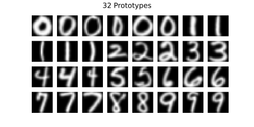
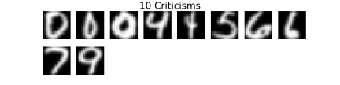
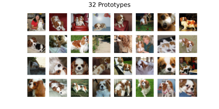
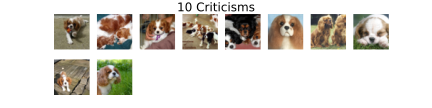
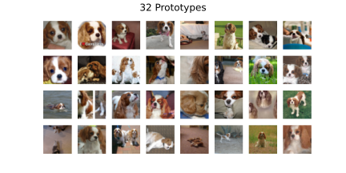
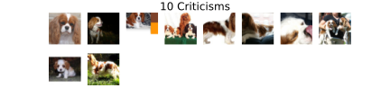

# MMD-critic
Work-in-progress implementation of 

**[Examples are not Enough, Learn to Criticize! Criticism for Interpretability. Been Kim, Rajiv Khanna, Sanmi Koyejo. NeurIPS 2016](https://proceedings.neurips.cc/paper/2016/hash/5680522b8e2bb01943234bce7bf84534-Abstract.html)**


## Setup
```
git clone https://github.com/maxidl/MMD-critic.git
cd MMD-critic
```

### Installing Dependencies

* pytorch (for now everything is run on cpu)
* matplotlib
* scikit-learn (for digits only)
* torchvision (for imagenet only)
* tqdm (for imagenet only)


Example dependency install using conda with cpu only pytorch:
```
conda create -n mmd-critic python=3.8 scikit-learn matplotlib
conda activate mmd-critic
conda install -c pytorch pytorch cpuonly 
```

### Downloading data for the digits example
```
mkdir ./data
wget https://raw.githubusercontent.com/BeenKim/MMD-critic/master/data/usps -P ./data
wget https://raw.githubusercontent.com/BeenKim/MMD-critic/master/data/usps.t -P ./data
```

### Digits example
```
python digits.py
```

<p align="center">
  </img>
</p>
<p align="center">
  </img>
</p>

### Imagenet example
```
python imagenet.py
```
This example requires the ImageNet dataset. Make sure to set `imagenet_root` inside of `imagenet.py`.

Some example plots for `class_name = 'Blenheim spaniel'`
<p align="center">
Using image embeddings (2084 dim) from resnet50
</p>
<p align="center">
  </img>
</p>
<p align="center">
  </img>
</p>

<p align="center">
Using raw images (flattened):
</p>
<p align="center">
  </img>
</p>
<p align="center">
  </img>
</p>

## Reference
* Paper: https://proceedings.neurips.cc/paper/2016/hash/5680522b8e2bb01943234bce7bf84534-Abstract.html
* If you find this code useful for your research, please cite the following:
    ```
    @inproceedings{kim2016MMD,
    title={Examples are not Enough, Learn to Criticize! Criticism for Interpretability},
    author={Been Kim, Rajiv Khanna and Sanmi Koyejo },
    booktitle={Advances in Neural Information Processing Systems},
    year={2016}
    }
    ```
* This code is based on the authors [original Implementation](https://github.com/BeenKim/MMD-critic), consider leaving a :star: on their repository to support authors releasing their code.
* Interpretable ML Book: [Chapter on Prototypes and Criticisms](https://christophm.github.io/interpretable-ml-book/proto.html)


## To-Do
* add 1NN classifier
* add more examples

